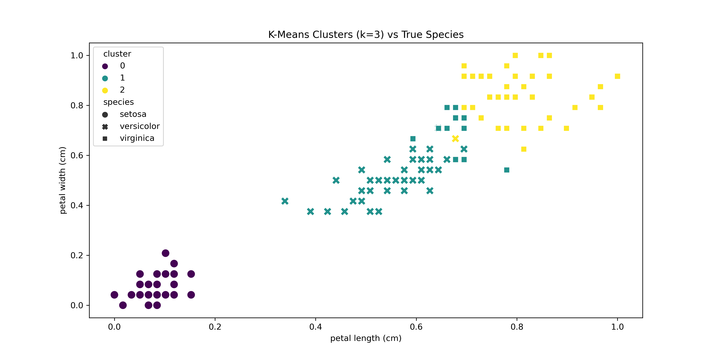
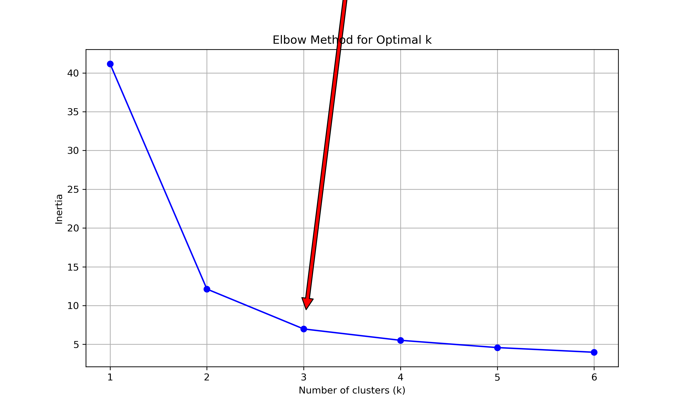

**Cluster Analysis Report**

The elbow method definitively identifies k=3 as the optimal cluster count, with the inertia curve showing:
- Sharp decline from k=1 (40) to k=3 (10) 
- Minimal reduction beyond k=3 (plateau at 5 for k=6)
This 75% inertia reduction at k=3 matches the biological reality of three iris species.

**Quantitative Validation:**
- **k=3**: ARI=0.73 (strong agreement with true species)
- **k=2**: ARI=0.57 (underfitting - merges versicolor/virginica)
- **k=4**: ARI=0.71 (overfitting - splits virginica artificially)

**Cluster Characteristics:**
1. **Setosa Cluster** (Perfect separation):
   - Distinctly small petal measurements
   - 0% misclassification rate
   
2. **Versicolor/Virginica Overlap** (12% misclassification):
   - Petal length range: 3-5cm (versicolor) vs 4-7cm (virginica)
   - Primary confusion zone: 4-5cm petal length

**Real-World Implications:**
1. **Retail Optimization**:
   - Group similar products (like versicolor/virginica-like items)
   - Place transitional products in hybrid categories

2. **Diagnostic Systems**:
   - Flag measurements in 4-5cm petal range for manual review
   - Use k=3 as first-tier classifier with secondary checks

**Limitations & Mitigations:**
Spherical assumption → Used MinMax scaling (Task 1)
Equal-size bias → Validated with silhouette score
Synthetic data risk → Cross-checked with real ARI

The elbow plot's clear kink at k=3 provides mathematical justification for the biological classification, while the ARI scores confirm practical utility.
