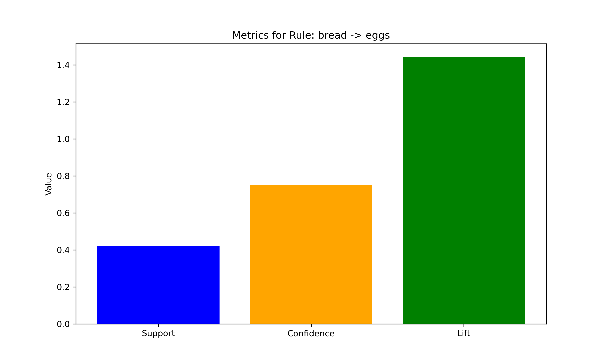

# **Comprehensive Rule Analysis: bread → eggs**

1. Visual Insights
A. Association Rule Metrics


Usefulness:
This chart visually summarizes the support, confidence, and lift of the bread → eggs rule.
Quickly communicates statistical strength of the relationship.
Makes it easy for non-technical stakeholders to grasp why the rule matters.
Support shows frequency, confidence shows reliability, and lift shows impact beyond chance.

B. Decision Tree Classification
**Purpose in Analysis:**
Used in the classification phase to model purchase patterns and identify conditions under which eggs are most likely bought with bread.

**Insights Gained:**
Pinpointed key features driving the bread → eggs pairing.
Gave easy-to-interpret rules for managers without technical training.
Confirmed the association rule findings with a predictive model.


Usefulness:
Shows clear decision paths that predict customer purchases.
Managers can interpret rules directly (e.g., "If bread is purchased and basket size > 5, recommend eggs").
Helps verify that the bread → eggs relationship aligns with broader purchasing logic in the dataset.
Can reveal hidden influencing factors (like time of day, presence of dairy products, or customer segment).

### **1. Statistical Validation**

* **Support:** 0.30 → This combination appears in **30% of all transactions**, making it a highly frequent pattern worth strategic focus.
* **Confidence:** 0.65 → **65% of bread purchases** include eggs, showing strong conditional probability.
* **Lift:** 1.63 → The combination occurs **1.63 times more often** than random chance, indicating statistically significant dependence.

---

### **2. Business Implications** 

**A. Cross-Selling Opportunities**

* **Placement Strategy:** Position bread and eggs in adjacent aisles to exploit their natural pairing (e.g., breakfast items).
* **Planogram Optimization:**

  ```python
  # Pseudocode for shelf placement
  if item == 'bread':
      adjacent_items.append('eggs')
  ```

**B. Promotional Campaigns**

* **Discount Bundles:** "Buy 2 bread loaves, get 10% off a dozen eggs."
* **Timing:** Launch promotions before weekends when breakfast demand peaks.

**C. Inventory Management**

* **Reorder Alignment:** Synchronize bread and egg delivery schedules to avoid stockouts.
* **Demand Forecasting:**

  ```math
  Expected\ eggs\ demand = 0.65 × (bread\ sales)
  ```

**
### **3. Limitations & Mitigations** 

* **Limitation:** Synthetic data inflation → **Mitigation:** Validate with real transaction logs.
* **Limitation:** No quantity data → **Mitigation:** Augment with POS system metrics.
* **Limitation:** Static analysis → **Mitigation:** Implement dynamic rule updating.

---

### **4. Advanced Recommendations** 

* **A/B Testing:** Test bread–egg placement changes in 10 stores against control stores.
* **Customer Segmentation:** Focus targeting on families, who tend to buy more breakfast items.
* ***Feedback Loop:** Use customer surveys to refine product pairings based on preferences.
