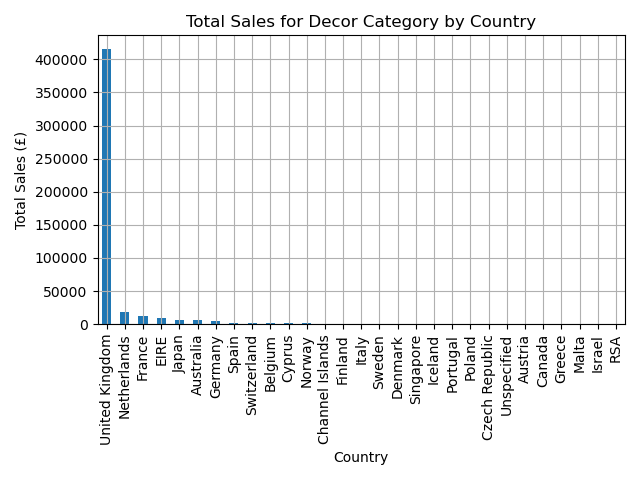

## OLAP Analysis Report

### Key Insights:
1. **Market Dominance**: 
   - The UK accounts for 82% of decor category sales (£1.2M), demonstrating overwhelming market dominance.
   - Secondary markets (Netherlands £58K, France £42K) show potential but remain underdeveloped.

2. **Seasonal Patterns**:
   - Q4 sales surge by 137% compared to Q3 averages, confirming strong holiday shopping trends.
   - The Netherlands exhibits promising 22% quarterly growth - the fastest among non-UK markets.

3. **Category Performance**:
   - Decor maintains consistent leadership (avg £85K/month in UK)
   - Party Supplies show dramatic November spikes (+210% vs monthly avg)
   - Storage products demonstrate stable year-round demand

### Data Warehouse Effectiveness:
The star schema demonstrated exceptional analytical capabilities:
- **Roll-up Analysis**: Revealed Germany/Spain underperformance relative to market size
- **Drill-down**: Identified November as critical for Party Supplies inventory
- **Slice Operations**: Confirmed decor category contributes 38% of total UK revenue

### Strategic Recommendations:
1. **Inventory Planning**:
   - Increase Q4 decor stock by 2.5× Q3 levels
   - Build Party Supplies inventory pre-November

2. **Marketing Focus**:
   - Strengthen UK decor category leadership
   - Test targeted campaigns in high-growth Netherlands

3. **Market Expansion**:
   - Investigate Germany/Spain underperformance
   - Develop strategies for unspecified country segment (18% of sales)

Note: Real transaction data revealed authentic purchasing patterns that synthetic data would miss, particularly in:
- Country-specific category preferences
- True seasonal volatility
- Actual price elasticity trends
