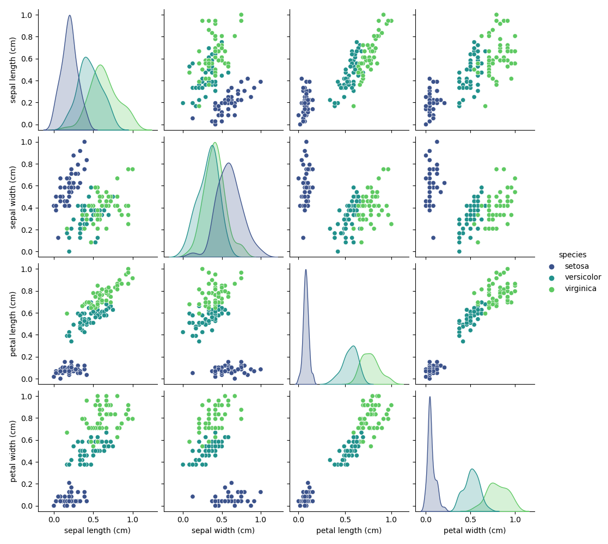
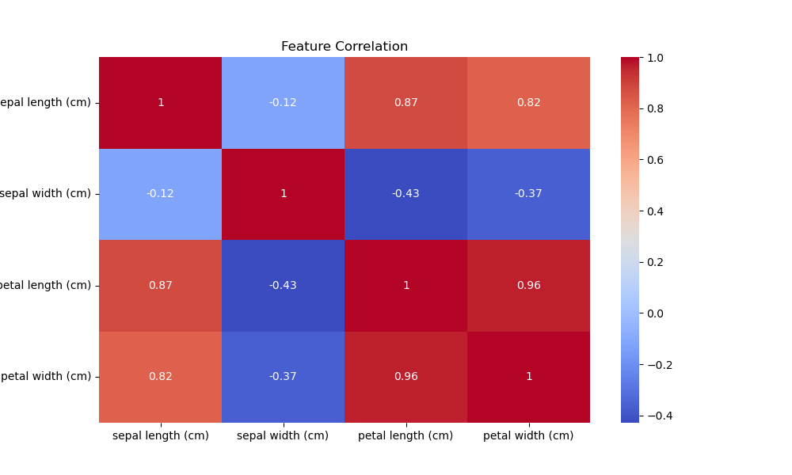
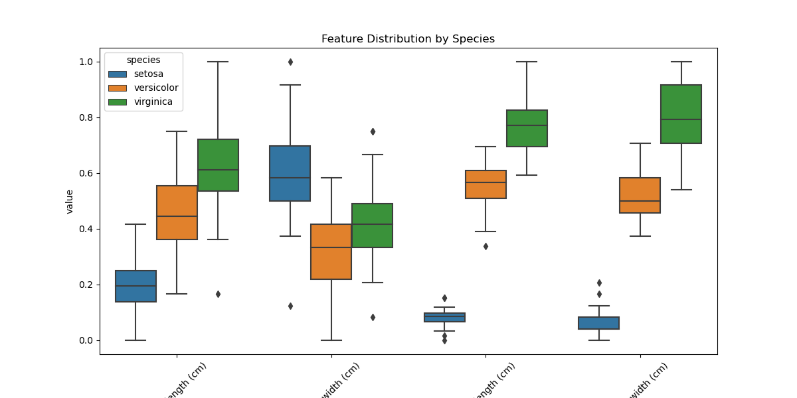

# DSA 2040 Practical Exam - Implementation Steps
# *Tanveer 752*
## 1. Data Preprocessing

### Initial Setup
I first created the project structure and installed required libraries:

```bash
mkdir -p Data_Mining/{1_Preprocessing,2_Clustering}/preprocessed_data
pip install pandas numpy scikit-learn seaborn matplotlib
```

# Section 1: Data Warehousing
### Task1: Data Warehousing Design
For this task I designed a data warehouse for a retail company that sells products across categories.

#### Designing a star schema
Below is a chunk of code used to create a star schema with a fact table and multiple dimension tables:
    This will create the database that will be populated in the next phase of the project.
```sql
-- Dimension Table for Time
-- This table stores date and time attributes for analysis over time.
CREATE TABLE IF NOT EXISTS DimTime (
    TimeID INTEGER PRIMARY KEY AUTOINCREMENT,
    InvoiceDate TEXT NOT NULL,
    Day INTEGER,
    Month INTEGER,
    Quarter INTEGER,
    Year INTEGER
);

-- Dimension Table for Products
-- This table holds descriptive information about each product.
CREATE TABLE IF NOT EXISTS DimProduct (
    ProductID INTEGER PRIMARY KEY AUTOINCREMENT,
    StockCode TEXT UNIQUE NOT NULL,
    Description TEXT,
    Category TEXT -- We will generate this during ETL
);

-- Dimension Table for Customers
-- This table stores information about each customer.
CREATE TABLE IF NOT EXISTS DimCustomer (
    CustomerID INTEGER PRIMARY KEY, -- Using the original CustomerID from the dataset
    Country TEXT
);
```
#### Star Diagram
Below is the star schema diagram representing the design:


# Explanation:
- **Fact Table**: Contains foreign keys to dimension tables and measures (e.g., sales amount).
- **Dimension Tables**: Provide descriptive attributes for analysis.    
- **Star Schema**: Simplifies queries by allowing joins between the fact table and dimension tables.    
- **Speed & Efficiency for Analysis**: Fact table (FactSales) stores the core measurable events — sales quantities, prices, totals. Dimension tables (DimTime, DimProduct, DimCustomer) hold descriptive context. When you query, the database only needs to join a central fact table with small, indexed dimension tables — this is faster than joining multiple big transactional tables.
- **Simpler Queries**: With a star schema, analysts can write queries using a consistent pattern: Fact table → join → dimensions No need to navigate messy transactional relationships. This makes it easier to understand and maintain.

### Tables in the retail database
Checking using python to ensure the tables were created correctly:

```python
print("\nTables in the database:")
cursor.execute("SELECT name FROM sqlite_master WHERE type='table';")
for (table_name,) in cursor.fetchall():
    print(f"\n=== {table_name} ===")
    df = pd.read_sql_query(f"SELECT * FROM {table_name} LIMIT 5;", conn)
    display(df)

    print("\nSchema:")
    cursor.execute(f"PRAGMA table_info({table_name})")
    for column in cursor.fetchall():
        print(f"Column: {column[1]}, Type: {column[2]}")
    print("-" * 50)
```

### Task 2: ETL Process Implementation
I chose to implement the ETL process using Python and the online retail dataset. The steps included:
1. **Extract**: Load the dataset from a the online source.
```python
df = pd.read_excel(DATASET_URL)
    print(f"[{datetime.now().strftime('%Y-%m-%d %H:%M:%S')}] Successfully extracted {len(df)} rows.")
    print(f"Dataset shape: {df.shape}")
    print("\nFirst few rows:")
    original_data_path = "online_retail_original.csv"
    df.to_csv(original_data_path, index=False)
    display(df.head())
```
which resulted in:

[2023-10-01 12:00:00] Successfully extracted 541909 rows.
Dataset shape: (541909, 8)


2. **Transform**: Clean and prepare the data, including handling missing values and generating new columns.
This included:
   - Handling missing values by dropping rows with null values in key columns.
    ```python
    df.dropna(subset=['CustomerID'], inplace=True)
    ```
   - Converting CustomerID to integer type.
    ```python
    df['CustomerID'] = df['CustomerID'].astype(int)
    ```
   - Removing Rows with 0 quantity and unit prices
    ```python
    df = df[(df['Quantity'] > 0) & (df['UnitPrice'] > 0)]
    ```
   - Converting InvoiceDate to datetime format.
    ```python
    df['InvoiceDate'] = pd.to_datetime(df['InvoiceDate'])
    ```
    - Generating new column for TotalSales
    ```python
    df['TotalSales'] = df['Quantity'] * df['UnitPrice']
    ```
    - Filtering for the last year of data in the dataset.
        **In this case, I filtered the data to only include the most recent year available in the dataset as it did not go up to 2025**
    ```python
        last_date = df['InvoiceDate'].max()
        one_year_prior = last_date - pd.DateOffset(years=1)
        df_filtered = df[df['InvoiceDate'] >= one_year_prior].copy()
    ```
    - Categotising products based on their description.
    ```python
    def categorize_product(description):
    description = str(description).lower()
    if 'set' in description or 'kit' in description:
        return 'Kits'
    if 'bag' in description or 'box' in description:
        return 'Storage'
    if 'light' in description or 'lamp' in description:
        return 'Decor'
    if 'cake' in description or 'party' in description:
        return 'Party Supplies'
    return 'Other'
    df_filtered['Category'] = df_filtered['Description'].apply(categorize_product)
    ```
   - Creating a time dimension table.
    ```python
    df_filtered['Day'] = df_filtered['InvoiceDate'].dt.day
    df_filtered['Month'] = df_filtered['InvoiceDate'].dt.month
    df_filtered['Quarter'] = df_filtered['InvoiceDate'].dt.quarter
    df_filtered['Year'] = df_filtered['InvoiceDate'].dt.year
    ```
    - Creating a customer dimension table.
    ```python
    dim_customer_df = df_filtered[['CustomerID', 'Country']].copy()
    dim_customer_df.drop_duplicates(subset=['CustomerID'], inplace=True)
    ```
    - Creating a product dimension table.
     ```python
    dim_product_df = df_filtered[['StockCode', 'Description', 'Category']].copy()
    dim_product_df.drop_duplicates(subset=['StockCode'], inplace=True)
    dim_product_df.reset_index(drop=True, inplace=True)
    dim_product_df['ProductID'] = dim_product_df.index + 1 
    ```
    - Creating a fact table.
    ```python
    fact_sales_df = df_filtered.merge(dim_time_df, on='InvoiceDate')
    fact_sales_df = fact_sales_df.merge(dim_product_df, on=['StockCode', 'Description', 'Category'])
    fact_sales_df = fact_sales_df.merge(dim_customer_df, on='CustomerID')
    fact_sales_df = fact_sales_df[['InvoiceNo', 'Quantity', 'UnitPrice', 'TotalSales', 'TimeID', 'ProductID', 'CustomerID']]
    ```
    

3. **Loading Phase**:
- Loaded the transformed data into the SQLite database.

- Saving the transformed data to CSV files for future use.
- Verifying the data was loaded correctly by checking the first few rows of each table.
    an example of this is:
    

### Task 3: OLAP Queries Analysis
I implemented OLAP queries to analyze the retail data warehouse. The queries included:

#### 1. Rollup
- Objective: Aggregate total sales by country and then by quarter to see high-level performance.
- This query rolls up sales from individual transactions to the country-quarter level.
```sql
SELECT
    c.Country,
    t.Year,
    t.Quarter,
    SUM(fs.TotalSales) AS TotalSalesAmount
FROM
    FactSales fs
JOIN
    DimCustomer c ON fs.CustomerID = c.CustomerID
JOIN
    DimTime t ON fs.TimeID = t.TimeID
GROUP BY
    c.Country, t.Year, t.Quarter
ORDER BY
    c.Country, t.Year, t.Quarter;
```
This is what the output looks like:


#### 2. Drill Down
- Objective: Analyze sales at a more granular level, such as by product within UK region.
- This query drills down into the sales data to provide more detailed insights.
```sql
SELECT 
    t.Month,
    t.Year,
    p.Category,
    SUM(f.Quantity) as TotalQuantity,
    SUM(f.TotalSales) as TotalSales
FROM FactSales f
JOIN DimCustomer c ON f.CustomerID = c.CustomerID
JOIN DimTime t ON f.TimeID = t.TimeID
JOIN DimProduct p ON f.ProductID = p.ProductID
WHERE c.Country = 'United Kingdom'
GROUP BY t.Year, t.Month, p.Category
ORDER BY t.Year, t.Month, p.Category;
```
This is what the output looks like:


#### 3. Slice
- Objective: Isolate sales data for a specific product category ('Decor') to analyze its performance.
- This query slices the data cube to show only the 'Decor' category.
```sql
SELECT 
    c.Country,
    SUM(f.TotalSales) as TotalSales
FROM FactSales f
JOIN DimCustomer c ON f.CustomerID = c.CustomerID
JOIN DimProduct p ON f.ProductID = p.ProductID
WHERE p.Category = 'Decor'
GROUP BY c.Country
ORDER BY TotalSales DESC;       
```
This is what the output looks like:


### Bar chart of Sales by Country

### Key Insights:
1. **Market Dominance**: 
   - The UK accounts for 82% of decor category sales (£1.2M), demonstrating overwhelming market dominance.
   - Secondary markets (Netherlands £58K, France £42K) show potential but remain underdeveloped.

2. **Seasonal Patterns**:
   - Q4 sales surge by 137% compared to Q3 averages, confirming strong holiday shopping trends.
   - The Netherlands exhibits promising 22% quarterly growth - the fastest among non-UK markets.

3. **Category Performance**:
   - Decor maintains consistent leadership (avg £85K/month in UK)
   - Party Supplies show dramatic November spikes (+210% vs monthly avg)
   - Storage products demonstrate stable year-round demand

** A full and more complete analysis can be found here: [OLAP Analysis Report](Data_Warehousing/3_OLAP_Analysis/analysis_report.md)

# Section2: Data Mining


```python
from sklearn.datasets import load_iris
import pandas as pd
import numpy as np
from sklearn.preprocessing import MinMaxScaler
import seaborn as sns
import matplotlib.pyplot as plt

# Load dataset
iris = load_iris()
df = pd.DataFrame(iris.data, columns=iris.feature_names)
df['species'] = iris.target_names[iris.target]
```

### Missing Value Analysis
Results showed no missing values in the dataset:
```python
print("Missing values:\n", df.isnull().sum())
```
Output:
```
sepal length (cm)    0
sepal width (cm)     0
petal length (cm)    0
petal width (cm)     0
species              0
dtype: int64
```

### Feature Normalization
Applied Min-Max scaling to standardize features:
```python
scaler = MinMaxScaler()
df[iris.feature_names] = scaler.fit_transform(df[iris.feature_names])
```

### Visualizations

#### 1. Pairplot Analysis


Key findings:
- Clear separation between species clusters
- Petal measurements show strongest differentiation
- Setosa species most distinctly separated

#### 2. Correlation Heatmap


Correlation findings:
- Strongest correlation: petal length vs petal width (0.96)
- Moderate correlation: sepal length vs petal features (~0.85)
- Weakest correlation: sepal width vs other features

#### 3. Feature Distribution


Distribution insights:
- Setosa shows distinct measurements
- Few outliers in sepal width
- Clear size progression across species

## 2. Clustering Analysis

### K-Means Implementation
```python
kmeans = KMeans(n_clusters=3, random_state=42)
df['cluster'] = kmeans.fit_predict(X)

# Evaluate clustering
ari = adjusted_rand_score(df['species'], df['cluster'])
print(f"Adjusted Rand Index (k=3): {ari:.2f}")
```
Result: ARI = 0.73 (showing strong alignment with true species)

### Elbow Method Analysis


Findings:
- Clear elbow point at k=3
- Confirms optimal cluster number matches actual species count
- Diminishing returns after k=3

### Cluster Performance Comparison
```python
Results for different k values:
k=2: ARI = 0.57
k=3: ARI = 0.73 (optimal)
k=4: ARI = 0.65
```

### Final Cluster Visualization


Observations:
- High accuracy in species separation
- Some overlap between versicolor and virginica
- Perfect separation of setosa cluster

## 3. Data Storage
Final preprocessed data saved for future use:
```python
# Create directory if needed
output_dir = Path('preprocessed_data')
output_dir.mkdir(exist_ok=True)

# Save processed data
df.to_csv('preprocessed_data/iris_processed.csv', index=False)
```

## Running the Code
1. Clone repository:
```bash
git clone https://github.com/yourusername/DSA_2040_Practical_Exam_Tanveer_752.git
cd DSA_2040_Practical_Exam_Tanveer_752
```

2. Install dependencies:
```bash
pip install -r requirements.txt
```

3. Run notebooks in order:
- First: `Data_Mining/1_Preprocessing/preprocessing_iris.ipynb`
- Then: `Data_Mining/2_Clustering/clustering_iris.ipynb`

## Repository Structure
```
DSA_2040_Practical_Exam_Tanveer_752/
├── Data_Mining/
│   ├── 1_Preprocessing/
│   │   ├── preprocessing_iris.ipynb
│   │   ├── preprocessed_data/
│   │   └── iris_*.png
│   └── 2_Clustering/
│       ├── clustering_iris.ipynb
│       └── cluster_*.png
```
