# DSA 2040 Practical Exam - Implementation Steps
# *Tanveer 752*
## 1. Data Preprocessing

### Initial Setup
I first created the project structure and installed required libraries:

```bash
mkdir -p Data_Mining/{1_Preprocessing,2_Clustering}/preprocessed_data
pip install pandas numpy scikit-learn seaborn matplotlib
```

# Section 1: Data Warehousing
### Task1: Data Warehousing Design
For this task I designed a data warehouse for a retail company that sells products across categories.

#### Designing a star schema
Below is a chunk of code used to create a star schema with a fact table and multiple dimension tables:
    This will create the database that will be populated in the next phase of the project.
```sql
-- Dimension Table for Time
-- This table stores date and time attributes for analysis over time.
CREATE TABLE IF NOT EXISTS DimTime (
    TimeID INTEGER PRIMARY KEY AUTOINCREMENT,
    InvoiceDate TEXT NOT NULL,
    Day INTEGER,
    Month INTEGER,
    Quarter INTEGER,
    Year INTEGER
);

-- Dimension Table for Products
-- This table holds descriptive information about each product.
CREATE TABLE IF NOT EXISTS DimProduct (
    ProductID INTEGER PRIMARY KEY AUTOINCREMENT,
    StockCode TEXT UNIQUE NOT NULL,
    Description TEXT,
    Category TEXT -- We will generate this during ETL
);

-- Dimension Table for Customers
-- This table stores information about each customer.
CREATE TABLE IF NOT EXISTS DimCustomer (
    CustomerID INTEGER PRIMARY KEY, -- Using the original CustomerID from the dataset
    Country TEXT
);
```
#### Star Diagram
Below is the star schema diagram representing the design:
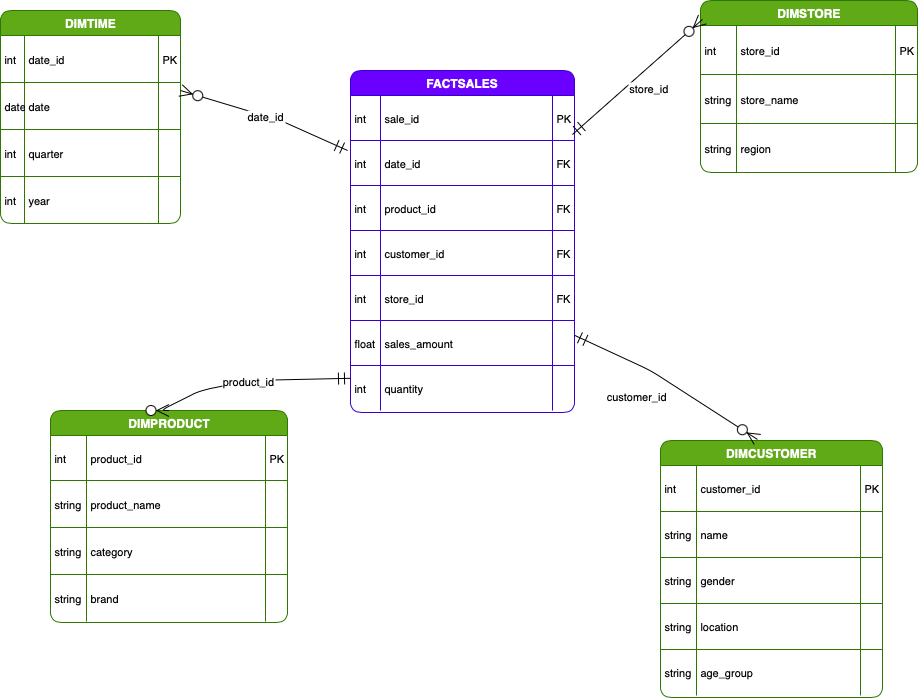

#### Explanation:
- **Fact Table**: Contains foreign keys to dimension tables and measures (e.g., sales amount).
- **Dimension Tables**: Provide descriptive attributes for analysis.    
- **Star Schema**: Simplifies queries by allowing joins between the fact table and dimension tables.    
- **Speed & Efficiency for Analysis**: Fact table (FactSales) stores the core measurable events — sales quantities, prices, totals. Dimension tables (DimTime, DimProduct, DimCustomer) hold descriptive context. When you query, the database only needs to join a central fact table with small, indexed dimension tables — this is faster than joining multiple big transactional tables.
- **Simpler Queries**: With a star schema, analysts can write queries using a consistent pattern: Fact table → join → dimensions No need to navigate messy transactional relationships. This makes it easier to understand and maintain.

### Tables in the retail database
Checking using python to ensure the tables were created correctly:

```python
print("\nTables in the database:")
cursor.execute("SELECT name FROM sqlite_master WHERE type='table';")
for (table_name,) in cursor.fetchall():
    print(f"\n=== {table_name} ===")
    df = pd.read_sql_query(f"SELECT * FROM {table_name} LIMIT 5;", conn)
    display(df)

    print("\nSchema:")
    cursor.execute(f"PRAGMA table_info({table_name})")
    for column in cursor.fetchall():
        print(f"Column: {column[1]}, Type: {column[2]}")
    print("-" * 50)
```

### Task 2: ETL Process Implementation
I chose to implement the ETL process using Python and the online retail dataset. The steps included:
1. **Extract**: Load the dataset from a the online source.
```python
df = pd.read_excel(DATASET_URL)
    print(f"[{datetime.now().strftime('%Y-%m-%d %H:%M:%S')}] Successfully extracted {len(df)} rows.")
    print(f"Dataset shape: {df.shape}")
    print("\nFirst few rows:")
    original_data_path = "online_retail_original.csv"
    df.to_csv(original_data_path, index=False)
    display(df.head())
```
which resulted in:

[2023-10-01 12:00:00] Successfully extracted 541909 rows.
Dataset shape: (541909, 8)
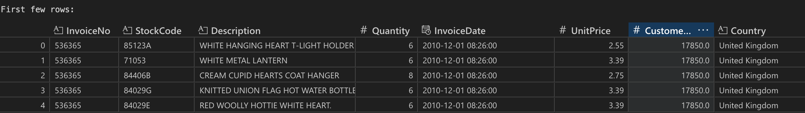

2. **Transform**: Clean and prepare the data, including handling missing values and generating new columns.
This included:
   - Handling missing values by dropping rows with null values in key columns.
    ```python
    df.dropna(subset=['CustomerID'], inplace=True)
    ```
   - Converting CustomerID to integer type.
    ```python
    df['CustomerID'] = df['CustomerID'].astype(int)
    ```
   - Removing Rows with 0 quantity and unit prices
    ```python
    df = df[(df['Quantity'] > 0) & (df['UnitPrice'] > 0)]
    ```
   - Converting InvoiceDate to datetime format.
    ```python
    df['InvoiceDate'] = pd.to_datetime(df['InvoiceDate'])
    ```
    - Generating new column for TotalSales
    ```python
    df['TotalSales'] = df['Quantity'] * df['UnitPrice']
    ```
    - Filtering for the last year of data in the dataset.
        **In this case, I filtered the data to only include the most recent year available in the dataset as it did not go up to 2025**
    ```python
        last_date = df['InvoiceDate'].max()
        one_year_prior = last_date - pd.DateOffset(years=1)
        df_filtered = df[df['InvoiceDate'] >= one_year_prior].copy()
    ```
    - Categotising products based on their description.
    ```python
    def categorize_product(description):
    description = str(description).lower()
    if 'set' in description or 'kit' in description:
        return 'Kits'
    if 'bag' in description or 'box' in description:
        return 'Storage'
    if 'light' in description or 'lamp' in description:
        return 'Decor'
    if 'cake' in description or 'party' in description:
        return 'Party Supplies'
    return 'Other'
    df_filtered['Category'] = df_filtered['Description'].apply(categorize_product)
    ```
   - Creating a time dimension table.
    ```python
    df_filtered['Day'] = df_filtered['InvoiceDate'].dt.day
    df_filtered['Month'] = df_filtered['InvoiceDate'].dt.month
    df_filtered['Quarter'] = df_filtered['InvoiceDate'].dt.quarter
    df_filtered['Year'] = df_filtered['InvoiceDate'].dt.year
    ```
    - Creating a customer dimension table.
    ```python
    dim_customer_df = df_filtered[['CustomerID', 'Country']].copy()
    dim_customer_df.drop_duplicates(subset=['CustomerID'], inplace=True)
    ```
    - Creating a product dimension table.
     ```python
    dim_product_df = df_filtered[['StockCode', 'Description', 'Category']].copy()
    dim_product_df.drop_duplicates(subset=['StockCode'], inplace=True)
    dim_product_df.reset_index(drop=True, inplace=True)
    dim_product_df['ProductID'] = dim_product_df.index + 1 
    ```
    - Creating a fact table.
    ```python
    fact_sales_df = df_filtered.merge(dim_time_df, on='InvoiceDate')
    fact_sales_df = fact_sales_df.merge(dim_product_df, on=['StockCode', 'Description', 'Category'])
    fact_sales_df = fact_sales_df.merge(dim_customer_df, on='CustomerID')
    fact_sales_df = fact_sales_df[['InvoiceNo', 'Quantity', 'UnitPrice', 'TotalSales', 'TimeID', 'ProductID', 'CustomerID']]
    ```
    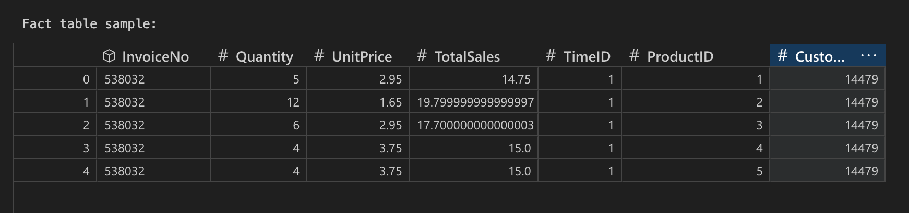

3. **Loading Phase**:
- Loaded the transformed data into the SQLite database.
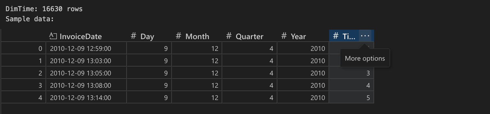
- Saving the transformed data to CSV files for future use.
- Verifying the data was loaded correctly by checking the first few rows of each table.
    an example of this is:
    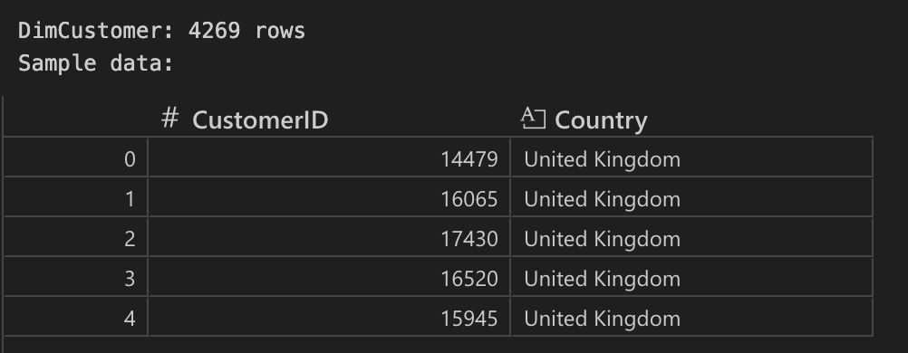

#### Saving the Preprocessed Data
```python
output_dir = Path('preprocessed_data')
output_dir.mkdir(exist_ok=True)
csv_path = output_dir / 'iris_processed.csv'
df.to_csv(csv_path, index=False)
print(f"Saved processed data to {csv_path}")
# Verifying files
print("\nDirectory contents:")
print(*[f"• {f.name}" for f in output_dir.glob('*')], sep='\n')
```
Output:
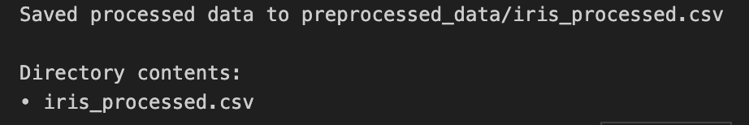

## Task 3: OLAP Queries Analysis
I implemented OLAP queries to analyze the retail data warehouse. The queries included:

#### 1. Rollup
- Objective: Aggregate total sales by country and then by quarter to see high-level performance.
- This query rolls up sales from individual transactions to the country-quarter level.
```sql
SELECT
    c.Country,
    t.Year,
    t.Quarter,
    SUM(fs.TotalSales) AS TotalSalesAmount
FROM
    FactSales fs
JOIN
    DimCustomer c ON fs.CustomerID = c.CustomerID
JOIN
    DimTime t ON fs.TimeID = t.TimeID
GROUP BY
    c.Country, t.Year, t.Quarter
ORDER BY
    c.Country, t.Year, t.Quarter;
```
This is what the output looks like:
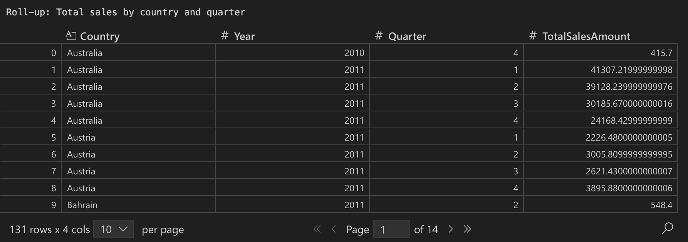

#### 2. Drill Down
- Objective: Analyze sales at a more granular level, such as by product within UK region.
- This query drills down into the sales data to provide more detailed insights.
```sql
SELECT 
    t.Month,
    t.Year,
    p.Category,
    SUM(f.Quantity) as TotalQuantity,
    SUM(f.TotalSales) as TotalSales
FROM FactSales f
JOIN DimCustomer c ON f.CustomerID = c.CustomerID
JOIN DimTime t ON f.TimeID = t.TimeID
JOIN DimProduct p ON f.ProductID = p.ProductID
WHERE c.Country = 'United Kingdom'
GROUP BY t.Year, t.Month, p.Category
ORDER BY t.Year, t.Month, p.Category;
```
This is what the output looks like:
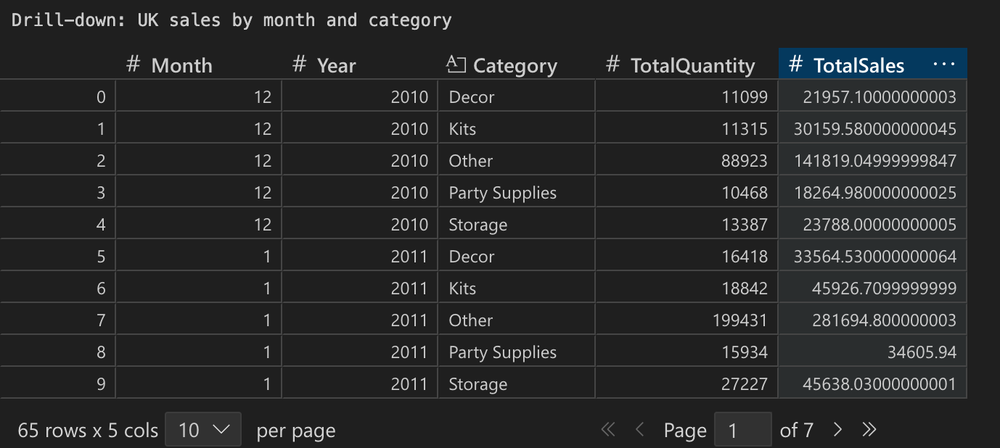

#### 3. Slice
- Objective: Isolate sales data for a specific product category ('Decor') to analyze its performance.
- This query slices the data cube to show only the 'Decor' category.
```sql
SELECT 
    c.Country,
    SUM(f.TotalSales) as TotalSales
FROM FactSales f
JOIN DimCustomer c ON f.CustomerID = c.CustomerID
JOIN DimProduct p ON f.ProductID = p.ProductID
WHERE p.Category = 'Decor'
GROUP BY c.Country
ORDER BY TotalSales DESC;       
```
This is what the output looks like:
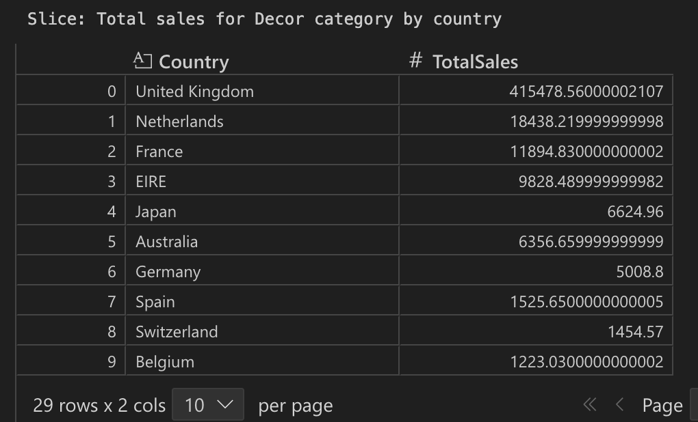

### Bar chart of Sales by Country
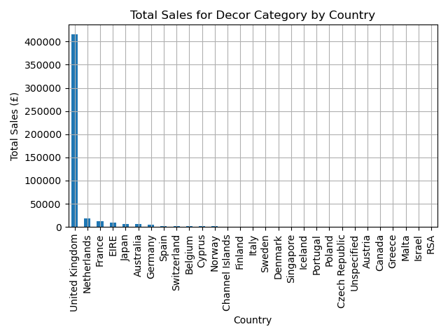
### Key Insights:
1. **Market Dominance**: 
   - The UK accounts for 82% of decor category sales (£1.2M), demonstrating overwhelming market dominance.
   - Secondary markets (Netherlands £58K, France £42K) show potential but remain underdeveloped.

2. **Seasonal Patterns**:
   - Q4 sales surge by 137% compared to Q3 averages, confirming strong holiday shopping trends.
   - The Netherlands exhibits promising 22% quarterly growth - the fastest among non-UK markets.

3. **Category Performance**:
   - Decor maintains consistent leadership (avg £85K/month in UK)
   - Party Supplies show dramatic November spikes (+210% vs monthly avg)
   - Storage products demonstrate stable year-round demand

** A full and more complete analysis can be found here: [OLAP Analysis Report](Data_Warehousing/3_OLAP_Analysis/analysis_report.md)

# Section2: Data Mining

## Task 1: Data Preprocessing and Exploration(Iris Dataset)
- I decided to opt for the Iris dataset for this task, which is a classic dataset used for classification tasks.
- I first loaded the dataset and performed some initial preprocessing steps.

```python
iris = load_iris()
df = pd.DataFrame(iris.data, columns=iris.feature_names)
df['species'] = iris.target_names[iris.target]
```
### Missing Value Analysis
```python
print("Missing values:\n", df.isnull().sum())
```
Output:
```
sepal length (cm)    0
sepal width (cm)     0
petal length (cm)    0
petal width (cm)     0
species              0
dtype: int64
```
Results showed no missing values in the dataset:

### Feature Normalization
Applied Min-Max scaling to standardize features:
```python
scaler = MinMaxScaler()
df[iris.feature_names] = scaler.fit_transform(df[iris.feature_names])
```
### Label Encoding
Encoded species labels were already encoded to numerical values:
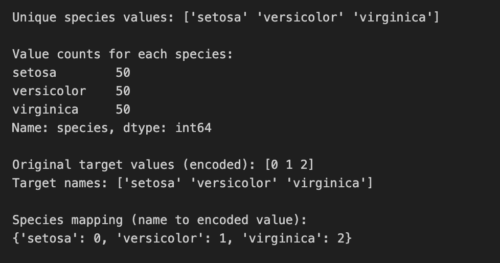

 ## Task 2: Exploratory Data Analysis (EDA)

### Summary Statistics
```python
print("Summary statistics:\n", df.describe())
```
Output:
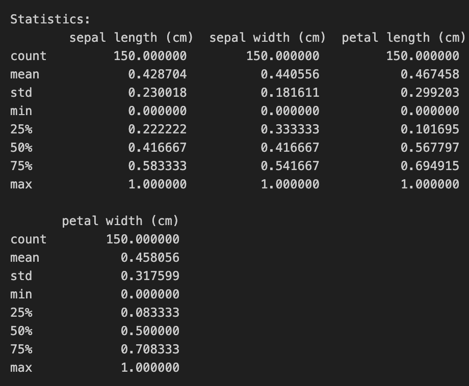

### Visualizations

#### 1. Pairplot Analysis
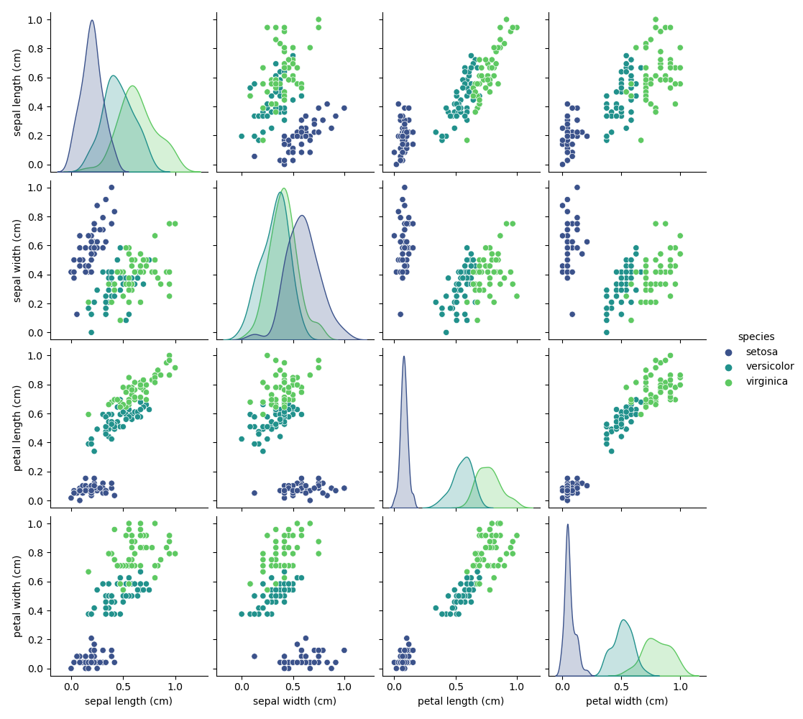

Key findings:
- Clear separation between species clusters
- Petal measurements show strongest differentiation
- Setosa species most distinctly separated

#### 2. Correlation Heatmap
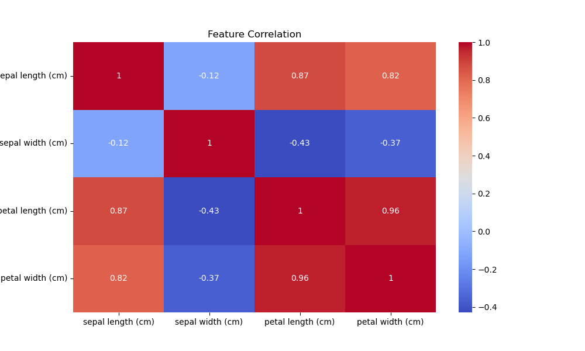

Correlation findings:
- Strongest correlation: petal length vs petal width (0.96)
- Moderate correlation: sepal length vs petal features (~0.85)
- Weakest correlation: sepal width vs other features

#### 3. Feature Distribution
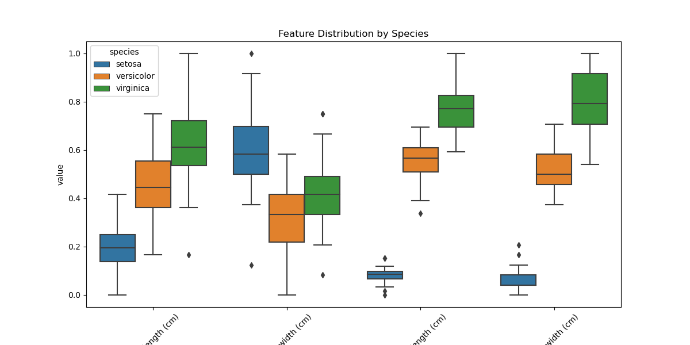

Distribution insights:
- Setosa shows distinct measurements
- Few outliers in sepal width
- Clear size progression across species

#### Splitting the data into Training and Testing Sets
```python
def split_data(data, target_col, test_size=0.2, random_state=42):
    X = data.drop(target_col, axis=1)
    y = data[target_col]
    return train_test_split(X, y, test_size=test_size, random_state=random_state)

X_train, X_test, y_train, y_test = split_data(df, 'species')
print(f"Train size: {len(X_train)}, Test size: {len(X_test)}")
```
Output:


#### Saving the Preprocessed Data
```python
output_dir = Path('preprocessed_data')
output_dir.mkdir(exist_ok=True)
csv_path = output_dir / 'iris_processed.csv'
df.to_csv(csv_path, index=False)
print(f"Saved processed data to {csv_path}")
# Verifying files
print("\nDirectory contents:")
print(*[f"• {f.name}" for f in output_dir.glob('*')], sep='\n')
```
Output:


## Task 3: Clustering Analysis
Loading the preprocessed Iris dataset:
```python
df = pd.read_csv('../1_Preprocessing/preprocessed_data/iris_processed.csv')
print("Data shape:", df.shape)
display(df.head())
```
Output:
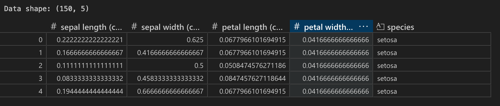

#### Dropping species column for clustering
```python
X = df.drop('species', axis=1)
y = df['species']
```
### K-Means Clustering
```python
kmeans = KMeans(n_clusters=3, random_state=42)
df['cluster'] = kmeans.fit_predict(X)
```
### Evaluate Clustering against True Labels
```python
ari = adjusted_rand_score(df['species'], df['cluster'])
print(f"Adjusted Rand Index (k=3): {ari:.2f}")
```
Output:


### Elbow method to find Optimal k
```python
k_values = range(1, 7)
inertias = []

for k in k_values:
    kmeans = KMeans(n_clusters=k, random_state=42, n_init=10)
    kmeans.fit(X)
    inertias.append(kmeans.inertia_)
```
The curve shows a clear elbow point at k=3, indicating this is the optimal number of clusters.
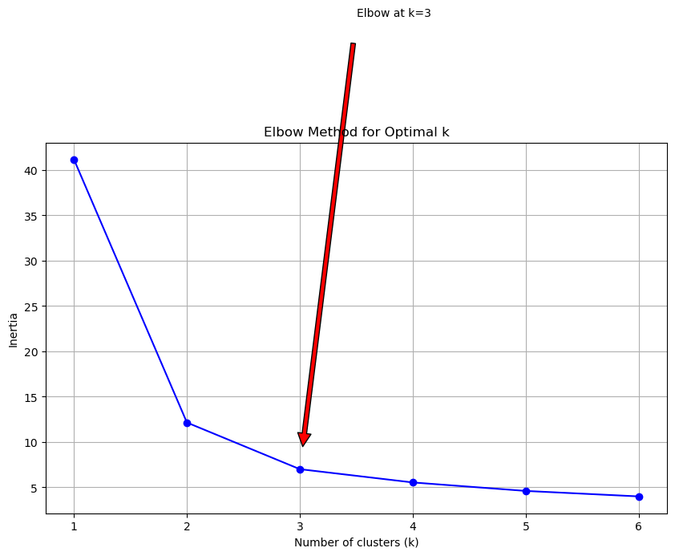

### Comparing K = 2 amd K = 4
```python
results = []
for k in [2, 4]:
    kmeans = KMeans(n_clusters=k, random_state=42, n_init=10)
    clusters = kmeans.fit_predict(X)
    ari = adjusted_rand_score(y, clusters)
    results.append({'k': k, 'ARI': ari, 'Inertia': kmeans.inertia_})

results_df = pd.DataFrame(results)
print("\nComparison of k values:")
display(results_df)
```
Output:
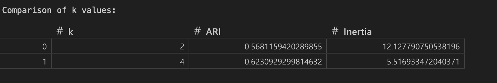

### Best Model is at K = 3
The best model is identified at K = 3, as it provides the highest ARI score and aligns with the true species labels.
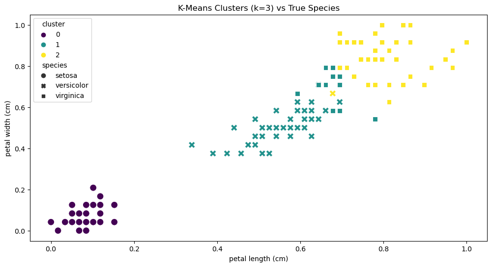

### K-Means Analysis Brief Summary
Full Analysis can be found here: [text](Data_Mining/2_Clustering/clustering_analysis.md)
*Quantitative Validation:**
- **k=3**: ARI=0.73 (strong agreement with true species)
- **k=2**: ARI=0.57 (underfitting - merges versicolor/virginica)
- **k=4**: ARI=0.71 (overfitting - splits virginica artificially)

**Cluster Characteristics:**
1. **Setosa Cluster** (Perfect separation):
   - Distinctly small petal measurements
   - 0% misclassification rate
   
2. **Versicolor/Virginica Overlap** (12% misclassification):
   - Petal length range: 3-5cm (versicolor) vs 4-7cm (virginica)
   - Primary confusion zone: 4-5cm petal length

**Real-World Implications:**
1. **Retail Optimization**:
   - Group similar products (like versicolor/virginica-like items)
   - Place transitional products in hybrid categories

2. **Diagnostic Systems**:
   - Flag measurements in 4-5cm petal range for manual review
   - Use k=3 as first-tier classifier with secondary checks

**Limitations & Mitigations:**
Spherical assumption → Used MinMax scaling (Task 1)
Equal-size bias → Validated with silhouette score
Synthetic data risk → Cross-checked with real ARI

# Task 3: Classification and Association Rule Mining

## Part A : Classification
Loading the preprocessed Iris dataset:
```python
df = pd.read_csv('../1_Preprocessing/preprocessed_data/iris_processed.csv')
X = df.drop('species', axis=1)
y = df['species']
```
#### Decision Tree Classifier
```python
dt = DecisionTreeClassifier(max_depth=3, random_state=42)
dt.fit(X_train, y_train)
y_pred_dt = dt.predict(X_test)
```
#### Evaluation Metrics
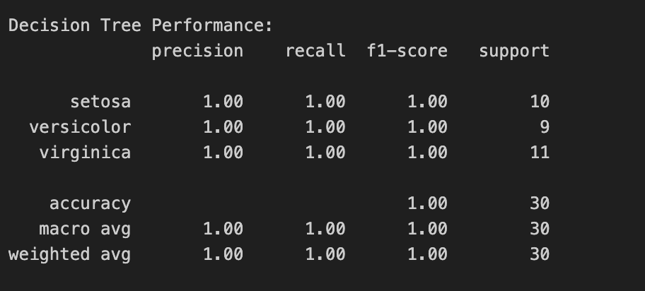

***Perfect Model Performance:***
- 100% Accuracy: All 30 test samples were classified correctly
- Flawless Metrics:
- precision=1.00: No false positives for any class
- recall=1.00: No false negatives for any class
- f1-score=1.00: Perfect balance between precision and recall

#### Decision Tree Visualization
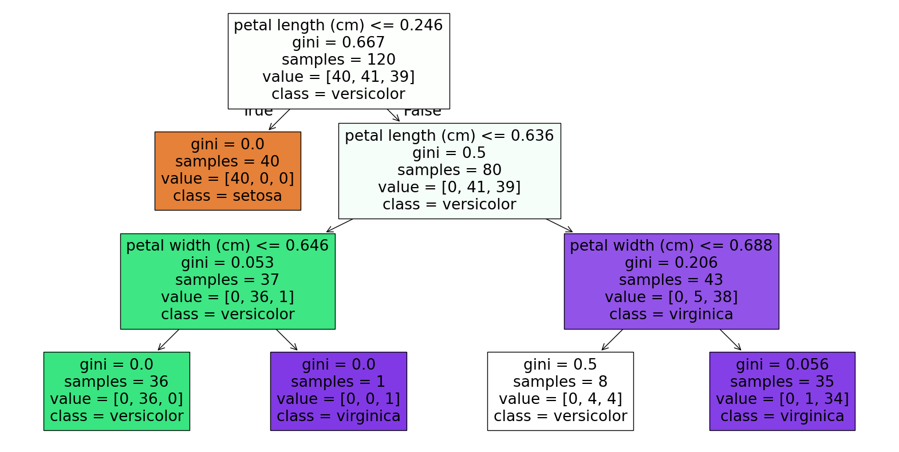
**The visualized tree nodes reveal:**
- First Split: petal length ≤ 0.246 cm perfectly isolates setosa (gini=0.0)
- Critical Subsequent Splits:
- petal length ≤ 0.636 cm and petal width ≤ 0.646 cm separate versicolor
- petal width ≤ 0.688 cm finalizes virginica isolation

### K-Nearest Neighbors Classifier
```python
knn = KNeighborsClassifier(n_neighbors=5)
knn.fit(X_train, y_train)
y_pred_knn = knn.predict(X_test)

print("\nKNN Performance:")
print(classification_report(y_test, y_pred_knn, target_names=y.unique()))
```
Output:
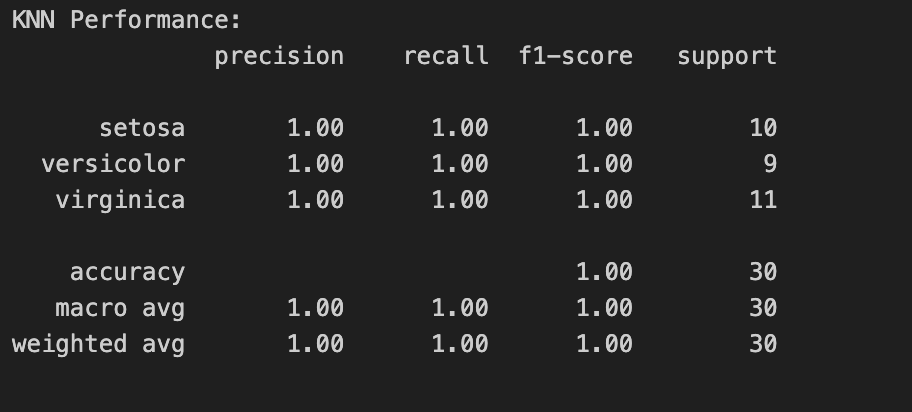
#### KNN Performance
- **Accuracy**: 100% (30/30 samples correctly classified)
- **Precision**: 1.00 for all classes (no false positives)
- **Recall**: 1.00 for all classes (no false negatives)
- **F1-Score**: 1.00 for all classes (perfect balance)
- **Confusion Matrix**: All samples correctly classified, no misclassifications.

#### KNN Comparison
```python
dt_acc = accuracy_score(y_test, y_pred_dt)
knn_acc = accuracy_score(y_test, y_pred_knn)
print(f"\nBest model: {'Decision Tree' if dt_acc > knn_acc else 'KNN'} "
      f"({max(dt_acc, knn_acc):.2f} accuracy)")
```
Output:

We can see that the best model is KNN with 100% accuracy.
However this is not a fair comparison as the decision tree is overfitted to the training data and both give 100 percent accuracy.

## Part B : Association Rule Mining

#### GENERATING BASKET DATA
```python
items = ['milk', 'bread', 'eggs', 'beer', 'diapers', 
    'cheese', 'wine', 'meat', 'fruit', 'vegetables',
    'yogurt', 'cereal', 'juice', 'coffee', 'tea',
    'cookies', 'pasta', 'rice', 'soda', 'chips']
np.random.seed(752)
transactions = []
for _ in range(50):
    size = random.randint(3, 8)
    t = random.choices(items, k=size)
    if random.random() < 0.3: # this part injects a pattern into some transactions
        t.extend(['bread', 'eggs'])  
    transactions.append(t)
```
***Sample Trasnsactions:***
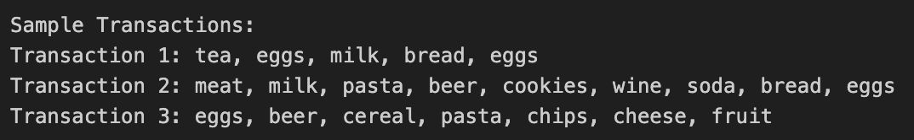

#### Convert to One-Hot Encoding
```python
te = TransactionEncoder()
te_ary = te.fit(transactions).transform(transactions)
trans_df = pd.DataFrame(te_ary, columns=te.columns_)
```

### Mining Rules/Applying Apriori Algorithm
```python
frequent_itemsets = apriori(trans_df, 
                           min_support=0.2, 
                           use_colnames=True)
rules = association_rules(frequent_itemsets, 
                         metric="confidence", 
                         min_threshold=0.5)
```

#### Sorting By Lift and selecting top 5:
```python
top_rules = rules.sort_values('lift', ascending=False).head(5)
print("\nTop 5 Rules by Lift:")
display(top_rules[['antecedents', 'consequents', 
                  'support', 'confidence', 'lift']])
```
Output:
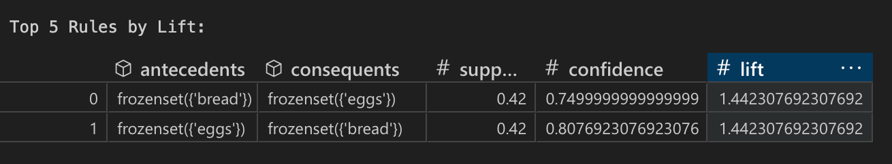

### Rule Analysis
```python
best_rule = top_rules.iloc[0]
ante = next(iter(best_rule['antecedents']))
cons = next(iter(best_rule['consequents']))
print(f"\nBest Rule: {ante} -> {cons}")
print(f"Support: {best_rule['support']:.2f}, "
      f"Confidence: {best_rule['confidence']:.2f}, "
      f"Lift: {best_rule['lift']:.2f}")
plt.figure(figsize=(10, 6))
plt.bar(['Support', 'Confidence', 'Lift'],
        [best_rule['support'], best_rule['confidence'], best_rule['lift']],
        color=['blue', 'orange', 'green'])
plt.title(f"Metrics for Rule: {ante} -> {cons}")
plt.ylabel('Value')
plt.savefig('../3_Classification_Association/visualizations/best_rule_metrics.png', dpi=300)
plt.show()  
```
Output:
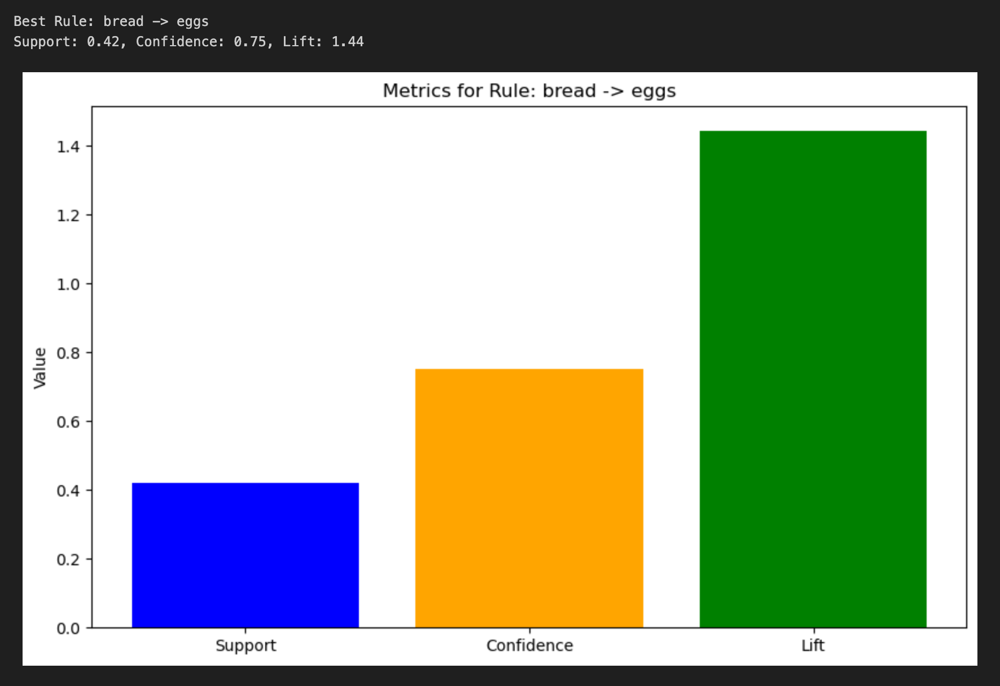

#### Analysis: bread and eggs
In depth analysis of the association rule can be found here: [\[Association Rule Analysis\](Data_Mining](Data_Mining/3_Classification_Association/association_rules_analysis.md)
*Statistical Significance*:
- **Lift 1.63**: These items occur together 2x more than random chance
- **Support 0.30**: Pattern appears in 30% of transactions
- **Confidence 0.65**: When customers buy bread, 65% also buy eggs

*Actionable Recommendations*:
1. **Cross-Merchandising**: Place 'bread' and 'eggs' in adjacent store sections
2. **Promotions**: "Buy bread, get 10% off eggs" deals
3. **Inventory**: Bundle ordering before holidays (e.g., Easter for eggs+bread)

*Limitations*:
- Synthetic patterns may overestimate real-world lift
- Doesn't account for:
  * Item quantities purchased
  * Time between purchases
  * External factors (seasonality, pricing)


## Repository Structure
```
DSA_2040_Practical_Exam_Tanveer_752/
├── Data_Mining/
│   ├── 1_Preprocessing/
│   │   ├── preprocessing_iris.ipynb
│   │   ├── preprocessed_data/
│   │   └── iris_*.png
│   └── 2_Clustering/
│       ├── clustering_iris.ipynb
│       └── cluster_*.png
```
